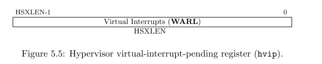

**注意！このドラフト仕様は、RISC-V Foundationに標準仕様として承認される前に変更される可能性があります。**

本章では、RISC-Vのハイパーバイザ拡張について説明する。ハイパーバイザ拡張は、Type-1、Type-2ハイパーバイザ上にゲストのオペレーティングシステムの効率的なホスティングをサポートするためのスーパバイザレベルアーキテクチャを仮想化するためのものである。ハイパーバイザー拡張は、スーパーバイザーモードを**ハイパーバイザー拡張スーパーバイザーモード**(hypervisor-extended supervisor mode : HSモード もしくは単純に**ハイパーバイザーモード**)に変更する。このモードはハイパーバイザーもしくはホスティング可能なオペレーティングシステムが動作するためのモードである。ハイパーバイザー拡張はもう一別のアドレス変換モードを追加する、これは**ゲスト物理アドレス (Guest Physical Address)**から**スーパーバイザー物理アドレス(supervisor physical address)**に変換するものであり、これによりゲストオペレーティングシステムのメモリおよびメモリマップドなI/Oサブシステムを仮想化する。HSモードはSモードと同様に動作するが、Sモード以外の命令とCSRレジスタが使用可能であり、これによりアドレス変換の新しいステージを制御しゲストOSを仮想的なSモード(VSモード)で動作することをサポートする。通常のSモードのオペレーティングシステムはHSモードとVSモードのゲストを変更することなく動作することができる。

<!-- https://ja.wikipedia.org/wiki/ハイパーバイザ#Type_1（「ネイティブ」または「ベアメタル」）ハイパーバイザ

> ハイパーバイザがハードウェア上で直接動作し、全てのOS（ゲストOS）はそのハイパーバイザ上で動作する方式を指す。狭義の「ハイパーバイザ」はこちらのみを指す。

https://upload.wikimedia.org/wikipedia/commons/thumb/f/fa/Diagramme_ArchiHyperviseur.png/300px-Diagramme_ArchiHyperviseur.png

- Type-2のハイパーバイザとは

https://ja.wikipedia.org/wiki/ハイパーバイザ#Type_2（「ホスト」）ハイパーバイザ

> ハードウェア上でまず別のOSが稼働し（このOSを**ホストOS**と呼ぶ）、その上でハイパーバイザが（ホストOSのアプリケーションとして）稼働し、更にはハイパーバイザの上で更に別のOS（このOSを**ゲストOS**と呼ぶ）を稼働させる方法である。狭義においては、Type 2はハイパーバイザには含まれない。

https://upload.wikimedia.org/wikipedia/commons/5/5c/Diagramme_ArchiEmulateur.png

-->

HSモードでは、OSもしくはハイパーバイザは、OSが通常通りSモードで動作しているのと同様なSBIを使ってマシンとやり取りを行う。HSモードのハイパーバイザーは、VSモードのゲストのためにSBIを実装することが期待されている。

ハイパーバイザー拡張は、`misa`CSRの7ビット目、つまりアルファベットのHに相当するビットを設定することによって有効化される。ハイパーバイザーを実装したRISC-VのHARTは`misa[7]`をハードワイヤにすることは推奨されておらず、この拡張を無効化することも可能にしておくべきである。

> ベースラインの特権アーキテクチャは、ゲストOSがユーザーレベルで実行される従来の仮想化技術の使用を簡素化するように設計されている。これは、いくつかの特権命令を簡単に検出してトラップできるためである。 ハイパーバイザー拡張機能は、これらのトラップの頻度を減らすことにより、仮想化のパフォーマンスを向上させる。
> ハイパーバイザー拡張機能は、ハイパーバイザーをSモードで実行し、ハイパーバイザーCSRアクセスのためにMモードにトラップし、シャドウページテーブルを維持することにより、拡張機能を実装しないプラットフォームで効率的にエミュレートできるように設計されている。 Type-2ハイパーバイザーのCSRアクセスの大部分は、有効なSモードアクセスであるため、トラップする必要はない。 ハイパーバイザーは、ネストされた仮想化を同様にサポートできる。

## 5.1 特権モード

"V"で表現される現在の**仮想化モード(virtualization mode)**はHARTがゲスト上で実行しているかどうかを示すものである。V=1であれば、HARTは仮想的なSモード(VSモード)もしくはVSモードで動作しているオペレーティングシステム上で仮想的なUモード(VUモード)として動作していることを意味する。V=0であれば、HARTはMモード、HSモード、もしくはHSモードで動作しているOS上のUモードで動作している。仮想化モードは、同様に2ステージアドレス変換モードが有効(V=1)か無効(V=0)であるかも示している。表5.1はRISC-V HARTのハイパーバイザー拡張における動作モードの一覧である。


---

メモ：

仮想モード(Virtualization Mode, Vビット)により、現在のHartがゲストとして実行されているのかどうかを判定する。

- V=1 : 仮想Sモード(VSモード), 仮想Uモード(VUモード)で動作している。これはゲストOS上で動作していることを意味する。また、V=1の場合は2レベルアドレス変換が有効である。
- V=0 : Mモード, HSモード, HSモード下のOS上で動作しているUモードのどれかである。

---

## 5.2 ハイパーバイザCSR

HSモード上で動作するOSとハイパーバイザは、例外と割り込み、アドレス変換を処理するためにスーパバイザCSRを使用する。追加のCSRはHSモードモード上で実装されており、VSモードで実装されていない。しかし、VSモードの2レベルアドレス変換と動作の制御を管理するために使用である。これらは、 `hstatus, hedeleg, hideleg, hvip, hip, hie, hgeip, hgeie, hcounteren, htimedelta, htimedeltah, htval, htinst, hgatp`である。

さらに、いくつかの**仮想スーパーバイザーCSR (VS CSR)**は通常のスーパーバイザーのレプリカである。例えば、VS CSRである`vsstatus`は通常の`sstatus`CSRのコピーである。

V=1のとき、VS CSRは該当するスーパーバイザーCSRの代替となる。特に指定されない限り通常のスーパーバイザーCSRの機能をすべて受け継ぐ。スーパーバイザーCSRに対する通常の読み書きの命令は、すべてVS CSRへのアクセスに置き換えられる。V=1のとき、別々のCSRアドレスに定義されたVS CSRに直接読み書きを行おうとするとそれは仮想命令例外が発生する。(Uモードで当該動作を実行しようとすると、通常の無効命令例外が発生する。)VS CSR自体は、MモードもしくはHSモードでのみアクセス可能である。

V=1の時、通常のHSレベルのスーパーバイザーCSRはVS CSR置き換えられる。この時スーパーバイザーCSRの値は保持されるが、特に文書化されない限り直接マシンの動作に影響を与えない。逆にV=0である場合、VS CSRは読み書き可能であるものの、マシンの動作に直接影響を与えない。

いくつかの標準的なスーパーバイザーCSR(`scounteren`や、N拡張が実装されている場合の`sedeleg`および`sideleg`)には、VS CSRに該当するCSRが用意されていない。これらのスーパバイザ―CSRは、V=1であっても、VSモードおよびVUモードがHSモードおよびUモードに置き換えられることを除いて引き続き通常の機能とアクセシビリティを保持している。ハイパーバイザーのソフトウェアは必要に応じてこれらのレジスタの内容を手動でスワップすることを期待されている。

> 一致するVS CSRは、複製する必要があるスーパーバイザCSRにのみ存在している。これは主に、トラップによって自動的に書き込まれるもの、またはトラップエントリの直後やSRETの直前で、ソフトウェアだけではまさに適切な瞬間にCSRをスワップできない場合に命令の実行に影響を与えるものである。 現在、ほとんどのスーパーバイザーCSRはこのカテゴリーに分類されるが、将来のCSRは分類されない可能性がある。

本章では、HSモードでの有効なXLENのことを`HSXLEN`と呼び、VSモードでの有効なXLENのことを`VSXLEN`と呼ぶ。

---

メモ：

- V=0
  - バックグラウンドCSR : VSモードの情報
  - フォアグラウンドCSR : HSモードの情報
- V=1
  - バックグラウンドCSR : HSモードの情報
  - フォアグラウンドCSR : VSモードの情報

HSモード時の`XLEN`のことを`HSXLEN`と呼ぶ。

---

### 5.2.1 ハイパーバイザーステータスレジスタ (hstatus)

`hstatus`レジスタはHSXLENビットの読み書き可能なレジスタである。HSXLEN=32の場合のフォーマットを図5.1に、HSXLEN=64の場合のフォーマットを図5.2に示している。`hstatus`レジスタは`mstatus`と同様の機能を提供するレジスタであり、VSモードのゲストの例外動作の制御及び記録を行っている。


VSXLフィールドはVSモード時の有効なXLEN値(この値がVSXLENとなる)を制御している。VSXLEN値はHSモード時のXLEN値(HSXLEN)と異なっていても良い。HSXLEN=32の時、VSXLフィールドは存在せず、VSXLEN=32となる。HSXLEN=64のとき、VSXLフィールドは**WARL**フィールドとなり、ページ16の表3.1の`misa`レジスタのMXL値と同様にエンコードされる。特殊なケースとして、VSXLEN=HSXLENであることが常に保証されるような実装の場合には、VSXLフィールドはRead-Onlyとして実装されることが許されている。

HSXLENの値が32からより大きな値に変更され、かつVSXL値が複数の値を許可する場合、VSXLの値は新しいHSXLEN値よりも小さく、かつ該当するサポート可能な最大値へと変更される。

`hstatus`のフィールドVTSR, VTW, VTVMは`mstatus`のTSR, TW, TVMと同様の役割を持つが、VSモード時にのみ有効であり、不正命令例外の代わりに仮想命令例外を生成する。VTSR=1の場合、VSモードにおいてSRET命令を実行しようとすると仮想命令例外が発生する。VTW=1の時(かつ`mstatus.TW=0`の時)、VSモードにおいてWFI命令を実行し、かつ実装依存の特定のタイムリミット内に命令が完了しなかった場合に仮想命令例外が発生する。VTVM=1の場合、VSモードにおいてSFENCE.VMA命令を実行するか、`satp`レジスタにアクセスしようとすると仮想命令例外が発生する。

VGEIN(Virtual Guest External Interrupt Number)フィールドは、VSレベルの外部割込みにおいてゲストの外部割込みソースを選択する。VGEIENは**WLRL**のフィールドで、ゼロからゲストを外部割込み番号(この値をGEILENとする)までのどれかの値を設定する必要がある。VGEIN=0の場合、VSレベルの外部ら割り込みには、どのゲスト外部割込みソースも選択されていない。GEILENが0の場合、VGEINはゼロに固定されている。ゲストの外部割込みについては**5.2.4節**で説明されており、VGEINのより詳細については**5.2.3節**で説明されている。

<a name="hstatus_HU">hstatus.HUフィールド</a>

HUフィールド(Hypervisor User mode)は仮想マシンのロード・ストア命令を制御する。HLV,HLVX, HSVフィールドはUモードにおいて使用される。HU=1の場合、これらの命令がUモードではHSモードと同様に実行することができる。HU=0の場合、Uモードでこれらの命令を実行しようとすると不正命令例外が発生する。

> HUビットを使用すると、ハイパーバイザーの一部をUモードで実行して、仮想マシンのメモリへのアクセスを維持しながら、ソフトウェアのバグに対する保護を強化できる。

SPVビット(Supervisor Previous Virtualization Mode)HSモードでトラップが発生した場合に実装によって書き込まれる。`sttatus`のSPPビットがトラップ時の特権モードの値を書き込むように、`hstatus`のSPVビットはトラップ時の仮想モードVの値を書き込む。V=0にSRETが実行されると、SPVにはVが設定される。

<a name="hstatus_SPVP">hstatus.SPVPフィールド</a>

V=1時にトラップが発生しHSモードに遷移すると、`sstatus.SPP`と同様にトラップ時の特権モードがSPVP(Supervisor Previous Virtual Privilege)ビットに設定される。しかしトラップ前にV=0の場合には、SPVPはトラップ発生時には変更されない。SPVPは仮想マシンによって実行されるロードストア命令、HLV, HLVX, HSVによる明示的なメモリアクセスの有効な特権を管理している。

> SPVPがない場合、HLV、HLVX、およびHSVの命令が代わりに`sstatus.SPP`を参照してメモリアクセスの有効な特権を探した場合、HU = 1の場合でも、UモードはVSレベルで仮想マシンメモリにアクセスできなかった。 SRETを使用してUモードに入ると、常にSPP = 0のままになる。 SPPとは異なり、フィールドSPVPは、HSモードとUモードの間を行ったり来たりする遷移の影響を受けない。

GVA(Guest Virtual Address)フィールドはトラップが発生しHSモードに入った場合に実装により書き込まれる。仮想アドレスを`stval`に書き込むようなトラップ(アクセス例外、ページフォルト、ゲストページフォルト)が発生した場合、GVAは1が設定される。HSモードに入るそれ以外のトラップでは、GVAは0に設定される。

> メモリアクセス例外の場合、HLV, HLVX, またはHSV命令の明示的なメモリアクセスによって例外が発生する場合を除いて、GVAはSPVフィールドと冗長になる(これらの2ビットは同じ値が設定される)。これ以外の場合には、SPV = 0かつGVA = 1となる。

VSBEビットは**WARL**フィールドであり、VSモードによって実行されるメモリアクセスのエンディアンを制御する。VSBE=0の場合、VSモードでの明示的なロードストアメモリアクセスはリトルエンディアンであり、VSBE=1の場合にはビッグエンディアンとなる。VSBEはVSレベルのページテーブルのようなメモリ管理データ構造の暗黙的なメモリアクセスについても制御を行う。VSBEをRead-Onlyに実装することで、常にHSモードと同じエンディアンを求めることも可能である。

### 5.2.2 ハイパーバイザーTrap移譲レジスタ (hedeleg / hideleg)

`hedeleg`と`hideleg`はHSXLENビットの読み書き可能なレジスタで、**図5.3**と**図5.4**にそれぞれレジスタのフォーマットを示す。デフォルトでは、すべての特権レベルのすべてのトラップはMモードで処理されるが、通常は`medeleg`と`mideleg`CSRレジスタを使用していくつかのトラップをHSモードに移譲する。`hedeleg`と`hideleg`CSRはこれらのトラップをさらにVSモードゲストに移譲することができる; これらのレジスタのレイアウトは`medeleg`と`mideleg`のレイアウトと同一である。


| ビット | 属性               | 該当する例外                              |
| ------ | ------------------ | ----------------------------------------- |
| 0      | (本文を参照のこと) | 命令アドレスミスアライン                  |
| 1      | 書き込み可能       | 命令アクセスフォルト                      |
| 2      | 書き込み可能       | 不正命令例外                              |
| 3      | 書き込み可能       | ブレークポイント                          |
| 4      | 書き込み可能       | ロードアドレスミスアライン                |
| 5      | 書き込み可能       | ロードアクセスフォルト                    |
| 6      | 書き込み可能       | ストア/AMOアドレスミスアライン            |
| 7      | 書き込み可能       | ストア/AMOアクセスフォルト                |
| 8      | 書き込み可能       | Environment Call from Uモード or VUモード |
| 9      | 読み込み専用 0     | Environment Call from HSモード            |
| 11     | 読み込み専用 0     | Environment Call from Mモード             |
| 12     | 書き込み可能       | 命令ページフォルト                        |
| 13     | 書き込み可能       | ロードページフォルト                      |
| 15     | 書き込み可能       | ストア/AMOページフォルト                  |
| 20     | 読み込み専用 0     | 命令ゲストページフォルト                  |
| 21     | 読み込み専用 0     | ロードゲストページフォルト                |
| 22     | 読み込み専用 0     | 仮想命令                                  |
| 23     | 読み込み専用 0     | ストア/AMOゲストページフォルト            |
|        |                    |                                           |

<div align="center">表5.2: hedelegの書き込み可能ビットと0に固定されているビット</div>

`medeleg`を使用してHSモードに移譲される同期トラップは、V=1の場合に`hedeleg`ビットがセットされている場合にさらにVSモードまで移譲される。`hedeleg`は書き込み可能なビットと、0に固定されているビットがある。`hedeleg`の多くのビットは書き込み可能もしくはゼロ固定であり、**表5.2**それらをまとめている。命令アドレスミスアラインに相当するビット0についてはIALIGN=32の場合にのみ書き込み可能としなければならない。

> `hedeleg`の特定のビットが書き込み可能であることを要求することにより、実装のバリエーションを処理するためのハイパーバイザーの負担が軽減される。

`mideleg`を使用してHSモードに移譲される例外は、`hideleg`のビットが設定されている場合にさらにVSモードまで移譲される。`hideleg`の15:0ビットのうち10ビット、6ビット、2ビットのみ書き込み可能である(これらは標準VSレベル割り込みに相当する)、それ以外のビットはゼロに固定されている。

仮想スーパバイザ―外部例外(要因コード10)がVSモードに渡されると、例外は自動的にVSモードのためにスーパーバイザー外部割込み(要因コード9)に移譲される。例外要因コードは同時に`vscause`にも書き込まれる。同様に、仮想スーパーバイザータイマー割り込み(要因コード6)はVSモードにてスーパーバイザータイマー割り込み(要因コード5)に変換され、仮想スーパーバイザーソフトウェア割り込み(要因コード2)はVSモードにてスーパーバイザーソフトウェア割り込み(要因コード1)に変換される。同様の変換はプラットフォームかカスタム割り込み要因(要因コード16以上)にも適用される可能性がある。

### 5.2.3 ハイパーバイザー割り込みレジスタ (hvip, hip, hie)

`hvip`はHSXELNビットの読み書き可能なレジスタであり、ハイパーバイザーが該当する仮想割り込みをVSモードのために書き込むことができるかどうかを示す。`hideleg`における書き込み可能なビットは、`hvip`においても同様に書き込み可能であり、そうでないビットは同様に0に固定されている。



`hvip`の標準的なビット位置(ビット15:0)のフォーマットを**図5.6**に示す。`hvip`のVSEIP=1に設定することにより、VSレベルの外部割込みがアサートされる; VSTIPを設定することにより、VSレベルのタイマー割り込みがアサートされる; VSSIP=1に設定することによりVSレベルのソフトウェア割り込みがアサートされる。


`hip`および`hie`レジスタはHSXELNビットの読み書き可能なレジスタであり、HSレベルの`sip`および`sie`レジスタをそれぞれ補完するものである。`hip`レジスタはVSレベルおよびハイパーバイザー固有の割り込みがペンディングしていることを示すレジスタであり、一方で`hie`は割り込みが許可されているかどうかを示している。`sip`と`sie`は、割り込み`i`は`hip`と`hie`の同じビット`i`が設定され、かつスーパーバイザレベルの割り込みがグローバルに有効化されている場合にはHSモードでトラップされる。


`sie`における書き込み可能なビットは、`hip`および`hie`においてゼロに固定されている。したがって、`sie`および`hie`のゼロでないビットは常に排他的であり、`sip`および`hip`も同様である。

> `hip`および`hie`の有効なビットはHSレベルの`sip`および`sie`には配置することができない。なぜならば、そのようにするとソフトウェアがハイパーバイザー拡張が実装されていないハードウェアにおいてハイパーバイザーをソフトウェアがエミュレートすることができないからである。

`sie`の`i`ビットがゼロに固定されている場合、`hip`の同じビットは書き込み可能であるか、読み込み専用である。もし`hip`のビット`i`が書き込み可能である場合、当該ビットに0を書き込むことにより、そのペンディングビットをクリアすることができる。もし割り込み`i`が`hip`のビットを設定することができるものの、`hip`の当該ビットが読み込み専用である場合、`hvip`の当該ビットをクリアするか、Execution Environmentコールを含む割り込みペンディングをクリアするためのいくつかのメカニズムを提供することが必要である。

`hip`においてペンディングすることのできるビットは、`hie`においても同じビットは書き込むことができる。`hie`の書き込みできないビットはゼロに固定されている。


`hip.SGEIP`および`hip.SGEIE`はスーパーバイザーレベル(HSレベル)のゲスト外部割込み向けの割り込みペンディングビットおよび割り込み許可ビットである。SGEIPは`hip`においては読み込み専用で、`hgeip`CSRおよび`hgeie`CSRの任意のビットがゼロでない場合の論理積が1である場合にのみ1が設定される。

`hip.SSEIP`および`hie.VSEIE`はVSレベルでの外部割込み向けの割り込みペンディングビットおよび割り込み許可ビットである。VSEIPは`hip`において読み込み専用であり、以下の割り込み要因の論理ORである：

- `hvip.VSEIP`ビット
- `hstatus.VGEIN`により選択された`hgeip`ビット; および
- VSレベルで指定される任意のプラッタフォーム独自の外部割込み信号

`hip.VSTIP`および`hie.VSTIE`ビットはVSレベルのタイマー割り込みの割り込みペンディングビットおよび割り込み許可ビットである。VSTIPは`hip`において読み込み専用であり、`hvip`の論理ORである。VSTIPは`hip`において読み込み専用であり、`hvip`の論理ORである。VSTIPおよび他の任意のプラットフォーム固有のタイマー割り込み信号はVSレベルに送信される。

`hip.VSSIP`および`hie.VSSIE`ビットはVSレベルのソフトウェア割込みの割り込みペンディングビットおよび割り込み許可ビットである。`hip`のVSSIPビットは`hvip`の当該ビットの(書き込み可能な)エイリアスである。

HSモードにおける複数同時の割り込みが発生した場合、以下の降順の優先度によって処理される：SEI, SSI, STI, SGEI, VSEI, VSSI, VSTI。

### 5.2.4 ハイパーバイザーゲスト外部割込みレジスタ (`hgeip`および`hgeie`)

`hgeip`レジスタはHSXLENビットの読み込み専用レジスタであり、**図5.11**に示すビットフォーマットで構成されている。このレジスタは当該HARTにおけるペンディングしていているゲスト外部割込みを示している。`hgeie`レジスタはHSXLENビットの読み書き可能なレジスタであり、**図5.12**に示すビットフォーマットで構成されている。このレジスタは当該HARTにおけるゲスト外部割込みの割り込み許可ビットである。ゲスト外部割込みの要因番号`i`が、`hgiep`と`hgeie`のビット`i`に相当する。


VSレベルでは、ゲスト外部割込みは個々の仮想マシンに対する割込みとして表現される。RISC-Vプラットフォームが、ハイパーバイザーの介入を最小限にしてゲストOSの直接制御下に物理デバイスを配置することをサポートしている場合(仮想マシンと物理デバイス間のパススルーや直接割り当てと言われている)、そのような状況では、デバイスからの割り込みは特定の仮想マシンを対象としている。`hgeip`の各ビットは、割り込みコントローラが収集して報告した、1つの仮想マシンに向けられた全ての保留中の割り込みをまとめたものである。複数のデバイスからの特定の保留中の割り込みを区別するためには、ソフトウェアは割り込みコントローラに問い合わせなければならない。

> ゲスト外部割込みをサポートするためには、割り込みコントローラ型の割り込みとは個別に仮想マシンに向けられた割り込みを収集できなければならない。

`hgeip`および`hgeie`に実装された割り込みの数は指定されておらず、おそらくゼロである。この値を`GEILEN`と呼び、0ビット目を含む下位のビットから先に実装される。従ってもしGEILENがゼロでない場合、`hgeie`のGEILEN:1ビットは書き込み可能であり、`hgeip`および`hgeie`の他のビットはゼロに固定されている。

> 1つの物理HARTで受信して処理されるゲスト外部割込みのセットは、他のHARTで受信したものとは異なる場合がある。1つの物理HARTでのゲスト外部割込み番号`i`は、通常、他のHARTでのゲスト外部割込み番号`i`と同じではないことが予想される。1つの物理HARTに対して、ゲスト外部割込みを直接受信できる仮想HARTの最大数はGEILENによって制限されている。この数の最大値は、どのような実装でも、物理HARTごとに、RV32では31個、RV64では63個である。
>
> ハイパーバイザーは、GEILENによって制限されることなく、仮想HARTの数に関係なく、常に自由にデバイスをエミュレートすることができます。割り込みの直接パススルー(直接割り当て)のみがGEILENの制限の対象となる。1つの仮想HARTが受け取ることができる個別の割り込みの数は、割り込みコントローラによって決定される。

`hgeie`レジスタはスーパーバイザーレベル(HSレベル)で発生するゲスト外部割込みの一部を選択する。`hgeie`の割り込み許可ビットは、`hstatus.VGEIN`により選択される`hgeip`のVSレベルでの外部割込み信号に影響を与えない。

### 5.2.5 ハイパーバイザーカウンタ許可レジスタ (`hcounteren`)

カウンタ許可レジスタ`hcounteren`はゲスト仮想マシン向けのハードウェアパフォーマンスモニタリングカウンタの利用可能状態を制御するための32ビットレジスタである。


`hcounteren`レジスタのCY、TM、IR、HPMnビットがクリアされている場合、V=1時に`cycle`, `time`, `instret`, `hpmcounter`nレジスタを読もうとすると、`mcounteren`の当該ビットが1であったとしても仮想命令例外が発生する。これらのビットがセットされている場合、V=1の時は、他に任意の理由でアクセスが禁止されていたとしても、当該レジスタへのアクセスは許可される。VUモードでは、`hcounteren`と`scounteren`のビットが設定されていたとしても、これらのカウンタの値は読み取ることができない。

`hcounteren`は常に実装されていなければならない。しかし、任意のビットの値はゼロに固定することができ、これはV=1のときに当該カウンタの値を読もうとすると例外が発生することを意味する。したがって、これらのビットは**WARL**フィールドであると言える。

### ハイパーバイザータイムデルタレジスタ (`htimedelta`, `htimedeltah`)

`htimedelta`CSRは`time`レジスタの値とVSモードおよびVUモードでの返される値の差分を保持している。つまり、`time`CSRをVSモードおよびVUモードで読むと、`htimedelta`と`time`の実際の値を加算した結果が返される。

> `htimedelta`と`time`の加算におけるオーバーフローは無視されるため、`htimedelta`の値が大きくなると、タイムオフセットの負の値して取り扱われる。


HSXLEN=32では、`htimedelta`はデルタ値の下位32ビットを保持している。`htimedeltah`はデルタ値の上位32ビットを保持している。


### 5.2.7 ハイパーバイザートラップ値レジスタ(`htval`)

`htval`レジスタはHSXLENビットの読み書き可能なレジスタで、**図5.16**に示すフォーマットで構成されている。トラップによりHSモードに入ると、`stval`と一緒に`htval`に例外要因固有の情報が書き込まれ、ソフトウェアがトラップを処理するために使用される。


ゲストページフォルト例外によりHSモードに移行した場合、`htval`にはゼロもしくは例外の発生したゲスト物理アドレスを2ビット右にシフトした値が書き込まれる。他の例外では、`htval`の値はゼロに設定されるが、将来の仕様アップデートや他の拡張によって`htval`の挙動が異なる可能性がある。

ゲストページフォルト例外は第1ステージ(VSステージ)のアドレス変換による暗黙的なメモリアクセスにより発生する可能性があるが、この場合には`htval`に書き込まれるゲスト物理アドレスは、例外の発生した暗黙的なメモリアクセスのアドレスとなる。例えば、VSレベルのページテーブルエントリのメモリ読み込みに失敗した場合などである。(VSステージでの変換が完了しなかった場合、オリジナルの仮想アドレスに相当するゲスト物理アドレスは未知である。)このような状態における曖昧さを削減するための更なる情報として`htinst`CSRが使用される。

そうでない場合、ミスアラインロード・ミスアラインストアによりゲストページフォルトが発生する場合には、`htval`には`stval`に格納されている仮想アドレスに対応する変換に失敗した物理アドレスが返される。可変長の命令を持つシステムでの命令ゲストページのフォルトの場合、ゼロではない` htval`は、`stval`の仮想アドレスで示される命令のフォルト部分に対応する。

> `htval`に書き込まれたゲスト物理アドレスは、現在のXLENよりも広いアドレスに対応するために2ビット右にシフトされる。RV32 では、ハイパーバイザ拡張により、34ビットのゲスト物理アドレスが許可され、htvalはそのアドレスの33:2ビットを報告する。このゲスト物理アドレスの2ビットシフトエンコーディングは、PMPアドレスレジスタ (Section 3.6) とページテーブルエントリ (Section 4.3, 4.4, 4.5) の物理アドレスのエンコーディングと一致している。

> 例外の発生したゲストの物理アドレスの最下位2ビットが必要な場合、これらのビットは通常、stvalの故障している仮想アドレスの最下位2ビットと同じである。VSステージのアドレス変換のための暗黙のメモリアクセスによる例外の場合、最下位2ビットは代わりにゼロになる。これらのケースは、レジスタ`htinst`で提供される値を用いて識別することができる。

`htval`は**WARL**レジスタであり、ゼロを保持していなければならず、ゲスト物理アドレスの2ビットシフトされたサブセットのみを保持することができる。

> (プラットフォーム標準などの)他の理由がない限り、ソフトウェアにより`htval`を書き込んだ場合にはその値が`htval`からリードバックできなければならない。

### 5.2.8 ハイパーバイザ―トラップ命令レジスタ (`htinst`)

`htinst`レジスタはHSXLENビットの読み書き可能なレジスタであり、**図5.17**に示されるビットフォーマットで構成されている。トラップが発生しHSモードに移行した場合、`htinst`はゼロでない場合例外の発生した命令の情報を保持しており、ソフトウェアによりトラップを処理するのを助ける役割を持っている。`htinst`に書き込まれる値に抜いてはSection 5.6.3で説明している。


`htinst`は**WARL**レジスタであり、実装がトラップ発生時に自動的に書き込んだ値を保持しておかなければならない。

### 5.2.9 ハイパーバイザーゲストアドレス変換および保護レジスタ (`hgatp`)

`htatap`レジスタはHSXLENビットの読み書き可能なレジスタであり、HSXLEN=32の場合のビットフォーマットを**図5.18**に、HSXLEN=64の場合のビットフォーマットを**図5.19**に示す。このレジスタはゲスト仮想アドレス変換の2番目のステージであるGステージアドレス変換の制御及び保護を行う(**5.5節**を参照のこと)。`satp`CSRレジスタと同様に、このレジスタはゲスト物理ルートページテーブルの物理ページ番号(PPN)、仮想マシン毎のアドレス変換を区別するための仮想マシン識別番号(VMID)、下種て物理アドレスの変換方法を選択するためのMODEフィールドから構成されている。`mstatus.TVM=1`の場合、HSモードでの`hgatp`レジスタを読み書きしようとすると命令例外が発生する。


**表5.3**はRV32とRV64におけるMODEフィールドのエンコーディングを示している。MODE=Bareでは、ゲスト物理アドレスはスーパーバイザー物理アドレスと同一であり、**3.6節**で示すようにゲスト仮想マシンと物理メモリ保護については追加的な保護は存在しない。この場合には、`hgatp`のほかのフィールドはゼロに設定していなければならない。

RV32では、MODEの有効な設定はSv32x4のみである。このモードでは通常のSv32ページ仮想メモリ方式を修正したもので、34ビットゲスト物理アドレスをサポートするために拡張したものである。RV64ではSv39x4およびSv48x4が定義されており、これはSv39およびSv49ページ仮想メモリ方式を修正したものである。これらのすべてのページ仮想メモリ方式については**5.5.1節**で説明している。RV64でさらに追加されている方式としてSv57x4が定義されており、これは仕様書の今後のバージョンで定義される予定である。

RV64におけるMODEフィールドの他の値については将来のために予約されており、`hgatp`の他のフィールドの異なる解釈のために使用される予定である。


RV64の実装では、すべてのRV64 MODE設定をサポートする必要はない。

`hgatp`におけるサポートされないMODEの書き込みは、`satp`のように無視されない。その代わり、`hgatp`のフィールドは**WARL**フィールドであり、そのような書き込みが発生した場合は識別される。

---

メモ：**WARL**とは Write Any Value, Read Legal Value。

一部の読み書きCSRフィールドは、一部のビットエンコーディングに対してのみ定義されていますが、読み出しの際には必ず適法な値を返すことを保証しながら、任意の値を書き込むことができます。CSRの書き込みに他の副作用がないと仮定して、サポートされている値の範囲を決定するには、希望の設定を書き込んでみて、その値が保持されているかどうかを確認するために読み出すことができます。これらの値は、レジスタの説明ではWARLと表示されています。

WARLフィールドへのサポートされていない値の書き込みで例外が発生することはありません。実装では、最後の書き込みが不正な値であった場合、WARLフィールドの読み出しで任意の正規の値を返すことができますが、返される正規の値は、不正に書き込まれた値とハートのアーキテクチャ状態に決定論的に依存します。

---

**5.5.1節**で説明しているように、ページ仮想メモリ方式(Sv32x4, Sv39x4, Sv48x4)では、ルートページテーブルは16kiBであり16KiB協会にアラインしていなければならない。これらのモードへは、`hgatp`内の物理ページ番号(PPN)フィールドの最下位2ビットは常にゼロが読みだされる。定義されているページ仮想メモリ方式のBareのどちらか、あるいは両方のみをサポートしている実装では、PPN[1:0]はゼロに固定していなければならない。

VIMDのビット数は定義されていないか、あるいはゼロである。VMIDの実装されているビット数のことを**VMIDLEN**と定義されるが、これはVMIDフィールドのすべてのビットに1を書き込み、`hgatp`の当該ビットをリードバックすることで保持されている1の数を調査することで識別できる。VMIDは下位のビットから先に実装される：つまり、VMIDLEN>0であれば、VMID[VMIDLEN-1:0]が書き込み可能である。VMIDLENの最大値(これをVMIDMAXと呼ぶ)はSv32x4では7であり、Sv39x4およびSv48x4では14である。

`hgatp`ページテーブルのアップデートと後続のGステージアドレス変換の順番を制約しているわけではない。新しい仮想マシンのゲスト物理ページテーブルが変更されると、`hgatp`への書き込みを行う前にHFENCE.GVMA命令を実行する必要がある可能性がある(**5.3.2節**を参照のこと)。

### 5.2.10 仮想スーパーバイザーステータスレジスタ (`vsstatus`)

`vsstatus`レジスタはVSXLENビットの読み書き可能なレジスタであり、VSモードでのスーパーバイザーステータス`sstatus`である。**図5.20**にVSXLEN=32でのビットフォーマット、**図5.21**にVSXLEN=64でのビットフォーマットを示す。V=1の場合に、`vsstatus`は`sstatus`の代替の役目を担い、従って`sstatus`を読み書きする命令はすべて`vsstatus`に置き換えられる。


UXLフィールドはVUモードでのXLEN値を制御しており、VSモードでのXLEN値(VSXLEN)とは異なる可能性がある。VSXLEN=32の場合、UXLフィールドは存在せず、VUモードでのXLEN=32である。VSXLEN=64の場合はUXLフィールドは**WARL**フィールドであり、16ページの**表3.1**における`misa`レジスタにおけるMXLのエンコーディングと同様である。特に、実装によってはUXLを読み込み専用フィールドとし、`hstatuts`のVSXLフィールドをコピーすることで強制的にVUモードにおいてXLEN=VSXLENとすることもできる。

VSXLENが32よりも大きな値に変更されると、UXLは単一の値に制限されなくなり、新しいVSXLENよりも小さな最も大きなサポート可能な値に変更される。

V=1の場合、`vsstatus.FS`およびHSレベルでの`sstatus.FS`が有効である。どちらかのフィールドが0(Off)である場合、浮動小数点命令を実行しようとすると命令違反例外が発生する。V=1の時、浮動小数点のステートを変更すると、どちらのフィールドも3(Dirty)に変更される。

> ハイパーバイザーが拡張コンテキストステータスの恩恵を受けるためには、VSモードで動作するゲストOSから独立して維持されているHSレベルの`sstatus`にそれ自身のコピーを持たなければならない。拡張コンテキスト状態のバージョンは明らかにVSモード用の`vsstatus`に存在しなければならないが、VSレベルのソフトウェアが`vsstatus.FS`を任意に変更できることを考えると、ハイパーバイザーはこのバージョンが正しく維持されているかどうかに頼ることはできない。V=1の間、HSレベルの`sstatus.FS`が独立してアクティブでなく、ハードウェアによって`vsstatus.FS`と並行して維持されていない場合、ハイパーバイザーは、仮想マシン間でコンテキストを切り替える際に、常に保守的にすべての拡張ポイントの状態をスワップすることを余儀なくされることになる。

読み込み専用のSDおよびXSフィールドは拡張コンテキストの状態を示しており、VSモードでのみ参照することができる。例えばHSレベルの`sstatus.FS`は`vsstatus.SD`に影響を与えない。

実装は、UBEを`hstatus.VSBE`の読み込み専用コピーとすることができる。

V=0の場合、`vsstatus`はマシンの動作に直接影響を与えないが、仮想マシンロードストア(HLV/HLVX/HSV)もしくは`mstatus`レジスタのMPRV機能は例外であり、V=1の時のようにロードストアを実行する際に使用される。

### 5.2.11 仮想スーパーバイザー割り込みレジスタ (`vsip`, `vsie`)

`vsip`と`vsie`はVSXLENビットの読み書き可能なレジスタで、`sip`と`sie`レジスタのVSモード版である。それぞれのビットフォーマットを**図5.22**および**図5.23**に示す。V=1の時、`vsip`と`vsie`は`sip`と`sie`の代替であり、`sip`および`sie`に対して読み書きを行う命令は、これらの命令に対する読み書きに置き換わる。しかし、HSレベルに挿入される割込みは引き続きHSレベルの`sip`レジスタが使用され、V=1の場合でも`vsip`は使用されない。


`vsip`と`vsie`の標準的なビット配置(ビット15:0)を**図5.24**と**図5.25**に示す。


`hideleg`のビット10が0の場合、`vsip.SEIP`と`vsie.SEIE`はゼロに固定されている。そうでなければ、`vsip.SEIP`と`vsie.SEIE`は`hip.VSEIP`と`hie.VSEIE`のエイリアスである。

`hideleg`のビット6が0の場合、`vsip.STIP`と`vsie.STIE`はゼロに固定されている。そうでなければ、`vsip.STIP`と`vsie.STIE`は`hip.VSTIP`と`hie.VSTIE`のエイリアスである。

`hideleg`のビット2が0の場合、`vsip.SSIP`と`vsie.SSIE`はゼロに固定されている。そうでなければ、`vsip.SSIP`と`vsie.SSIE`は`hip.VSSIP`と`hie.VSSIE`のエイリアスである。

---

メモ: Spikeにおける`vsip`と`vsie`の挙動：`mie`と`mip`を参照しているなあ。`hie`と`hip`も`mie`と`mip`を参照している。

```cpp
void processor_t::set_csr(int which, reg_t val)
{
/* ... */
    case CSR_VSIE: {
      reg_t mask = state.hideleg & MIP_VS_MASK;
      state.mie = (state.mie & ~mask) | ((val << 1) & mask);
      break;
    }
/* ... */
    case CSR_VSIP: {
      reg_t mask = state.hideleg & MIP_VSSIP;
      state.mip = (state.mip & ~mask) | ((val << 1) & mask);
      break;
    }
    case CSR_HIE: {
      reg_t mask = MIP_HS_MASK;
      state.mie = (state.mie & ~mask) | (val & mask);
      break;
    }
    case CSR_HIP: {
      reg_t mask = MIP_VSSIP;
      state.mip = (state.mip & ~mask) | (val & mask);
      break;
    }
}
reg_t processor_t::get_csr(int which, insn_t insn, bool write, bool peek)
{
    case CSR_VSIE: ret((state.mie & state.hideleg & MIP_VS_MASK) >> 1);
    /* ... */
    case CSR_VSIP: ret((state.mip & state.hideleg & MIP_VS_MASK) >> 1);
    case CSR_HIE: ret(state.mie & MIP_HS_MASK);
    case CSR_HIP: ret(state.mip & MIP_HS_MASK);
}
```

### 5.2.12 仮想スーパーバイザートラップベクタベースアドレスレジスタ (`vstvec`)

`vstvec`レジスタはVSXLENビットの読み書き可能なレジスタであり、スーパーバイザーレジスタ`stvec`のVSモード版である。ビットフォーマットを**図5.26**に示す。V=1の場合、`vstvec`は通常の`stvec`の代替となり、通常の`stvec`への読み書きを行う命令は`vstvec`への読み書きへと置き換えられる。V=0の場合は`vstvec`はマシンの動作には一切影響を与えない。


---

メモ：Spikeにおける`vstvec`の動作

```cpp
void processor_t::set_csr(int which, reg_t val)
{
...
    case CSR_STVEC:	// STVECへの参照時：V=1の場合はvstvecに書き込まれる
      if (state.v)
        state.vstvec = val & ~(reg_t)2;
      else
        state.stvec = val & ~(reg_t)2;
      break;
...
    case CSR_VSTVEC: state.vstvec = val & ~(reg_t)2; break;
...
}

void processor_t::get_csr()
{
...
    case CSR_STVEC: {	// STVECの読み出し時、V=1の場合はvstvecが読みだされる。
      if (state.v) {
        ret(state.vstvec);
      } else {
        ret(state.stvec);
      }
    }
    case CSR_VSTVEC: ret(state.vstvec);
}

```

---

### 5.2.13 仮想スーパーバイザースクラッチレジスタ (`vsscratch`)

`vsscratch`レジスタはVSXLENビットの読み書き可能なレジスタであり、スーパーバイザーモードの`sscrtach`のVSモードにおける大体である。ビットフォーマットを**図5.27**に示す。V=1の時、`vsscratch`は`sscratch`の代替であり、従って通常の`sscratch`へのアクセス命令は`vsscratch`に置き換えられる。`vsscratch`の値はマシンの動作に直接影響を与えない。


### 5.2.14 仮想スーパーバイザー例外プログラムカウンタ (`vsepc`)

`vsepc`レジスタはVSXLENビットの読み書き可能なレジスタであり、スーパーバイザーモードの`sepc`レジスタのVSモードでの代替である。ビットフォーマットを**図5.28**に示す。V=1の時、`vsepc`は通常の`sepc`の代替であり、従って通常の`sepc`レジスタへの読み書き命令は`vsepc`へのアクセスへ置き換えられる。V=0の時、このレジスタはマシンの動作に影響を与えない。

### 5.2.15 仮想スーパーバイザー要因レジスタ (`vscause`)

`vscause`レジスタはVSXLENビットの読み書き可能なレジスタであり、スーパーバイザーモードの`scause`レジスタのVSモードでの代替である。ビットフォーマットを**図5.29**に示す。V=1の場合、`vscause`は通常の`scause`のように動作するため、`scause`へのアクセス命令は`vscause`へのアクセスへ置き換えられる。V=0の場合、`vscause`はマシンの動作に影響を与えない。

`vscause`は**WLRL**レジスタのため、`scause`が保持することのできる値と同様の値を保持できなければならない。


### 5.2.16 仮想スーパーバイザートラップ値レジスタ (`vstval`)

`vstval`レジスタはVSXLENビットの読み書き可能なレジスタであり、スーパーバイザーモードの`stval`レジスタのVSモードでの代替である。ビットフォーマットを**図5.30**に示す。V=1の時、`vstval`は通常の`stval`のように動作するため、`stval`へのアクセス命令は`vstval`へのアクセスへ置き換えられる。V=0の場合、`vstval`はマシンの動作に影響を与えない。

`vstval`は**WARL**レジスタのため、`stval`が保持することのできる値と同様の値を保持できなければならない。


### 5.2.17 仮想スーパーバイザーアドレス変換および保護レジスタ (`vsatp`)

`vsatp`レジスタはVSXLENビットの読み書き可能なレジスタであり、スーパーバイザーモードの`satp`レジスタのVSモードでの代替である。**図5.31**にVSXLEN=32のビットフォーマットを、**図5.32**にVSXLEN=64のビットフォーマットを示す。V=1の時、`vsatp`レジスタは`satp`レジスタの代替であり、従って通常の`satp`レジスタへの読み書き命令は`vsatp`への読み書きに置き換えられる。`vsatp`レジスタはゲスト仮想アドレスの2ステージ変換における最初のステージであるVSステージのアドレス変換を制御する(**5.5節**を参照のこと)。


V=0の場合、`vsatp`へのサポートされないMODE値を書き込むと、`satp`レジスタのように無視されるわけではない。その代わりに、`vsatp`へのこのような書き込みは**WARL**として取り扱われる。

V=0の場合、`vsatp`はマシンの動作に直接影響を与えない。ただし仮想マシンのロードストア命令(HLV, HLVX, HSV)の挙動および`mstatus`レジスタにおける`MRPV`の挙動は、V=1かどうかに関わらずロードストア命令のために使用される。


- `VTSR / VTW, VTVM`ビット : `mstatus`と同様だが、V=1の時に、`RSET`, `WFI`命令で使用される。
- `SPV(Supervisor Previous Virtualization Mode)`ビット : 例外が発生したときにの、仮想モードの情報を記録する。V=0時にSRET命令が実行されると、SPVにVが設定される。
- HSモード時に例外が発生すると、例外が発生する前にSP2VとSP2PにSPVとHSレベルのSPPの値が設定される(例外の前に、HSレベルのSPPはV=0時には`sstatus`.SPPであり、V=1時には`bssatus`.SPPである)。V=0のときにSRET命令が実行されると、逆の操作が行われる: つまり、SPVと`sstatus`.SPPが新しい仮想モードの例外モードに設定される:つまり、それぞれの値はSP2V, SP2Pに書き込まれる。
- `STL(Supervisor Translation Level)`はメモリアクセス失敗、ページ例外時のアドレス変換レベルを示している。HSモードで例外が発生した場合には必ず設定される。
  - ゲスト物理アドレス変換中によるアクセス例外が発生した場合 : STLは1が設定される。
  - 他の例外の場合には : STLは0が設定される。
- SPRVビット
  - SPRV=0の場合 : メモリアクセス・プロテクションは通常通り行われる。
  - SPRV=1の場合 : ロード・ストアメモリアクセスは、現在の仮想モードがhstatus.SPVとして扱われ、現在の特権モードがHSレベルのSPPとして扱われる(V=0の場合は`sstatus`.SPPが使用され、V=1の場合は`bsstatus`.SPPとなる)。


- `hedeleg, hideleg`レジスタはHypervisor向けの移譲レジスタである。
-
