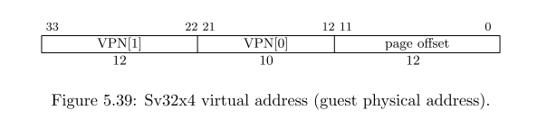
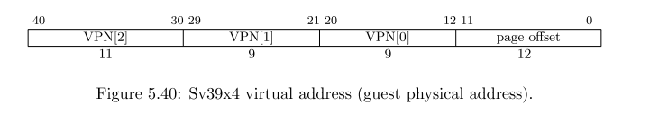
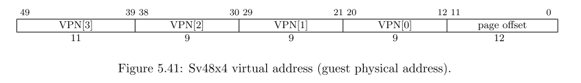

## 5.5 2ステージアドレス変換

現在の仮想モードVが1であるときは常に2ステージアドレス変換と保護が有効である。すべての仮想メモリアクセスにおいて、オリジナルの仮想アドレスは`vsatp`レジスタにより制御されるVSレベルアドレス変換によって最初のステージで変換され、**ゲスト物理アドレス**となる。ゲスト物理アドレスは次に`hgatp`レジスタにより制御されるゲスト物理アドレスに変換され、スーパーバイザー物理アドレスに変換される。この2つのステージはVSステージ変換とGステージ変換と呼ばれる。V=1の際にこれらの2ステージアドレス変換を無効化する方法はないが、該当する`vsatp`か`hgatp`のレジスタをゼロに設定することにより効率的にどちらかの変換を無効化することができる。

`vsstatus`のMXRフィールドは実行可能フラグのみ設定されているページを読み込み可能にすることができるが、これはVSステージのページ保護にのみ有効である。VSレベルでのMXRの設定はゲスト物理ページ保護の設定をオーバーライドしない。HSレベルでのMXRの設定では、VSステージとGステージ両方の実行可能フラグについてオーバーライドされる。

V=1では、アドレス変換を通常バイパスするメモリアクセスはGステージのアドレス変換のみを実行する目的がある。これはVSレベルのページの読み書きなど、VSステージアドレス変換のサポートも含まれる。

マシンレベルの物理メモリ保護については仮想モードの状態に関係なくスーパーバイザ物理アドレスにも適用される。

### 5.5.1 ゲスト物理アドレス変換

ゲスト物理アドレスからスーパーバイザー物理アドレスへの変換は、`hgatp`(**5.2.9節**) CSRレジスタにより制御される。

アドレス変換のスキームである`hgatp`のMODEフィールドでBareが設定されている場合、ゲスト物理アドレスとスーパーバイザー物理アドレスは全く変換されず同一であり、ゲスト物理アドレスからスーパーバイザ物理アドレスの変換中にメモリ保護は適用されない。

`hgatp.MODE`がSv32x4, Sv39x4, Sv48v4が選択されたとき、Gステージアドレス変換は通常の仮想アドレス変換のスキームであるSv32, Sv39, Sv48に相当するものである。個々の場合において、やってくるアドレスのサイズは2ビットずつ広げられる(34ビット、41ビット、50ビット)。2つの余分なビットにより、ルートページテーブル(のみ)がサイズを通常の4KiBから16KiBに拡張される。大きなサイズにマッチさせるために、ルートページテーブルは4KiBのページ境界ではなく16KiBのアドレス境界に配置されている必要がある。このことを除けば、Gステージの変換は通常のSv32, Sv39, Sv48と他の機能については何の違いもない。ルートページテーブルではないページ、そしてすべてのページテーブルエントリ(PTE)は**4.3節**, **4.4節**, **4.5節**で説明されているものと同一である。

Sv32x4では、やってくるゲスト物理アドレスは**図5.39**に示すように仮想ページ番号(VPN)とページオフセットに分割される。この分割方法はSv32における**図4.15(73ページ)**の分割方法と同一であるが、VPN[1]の上位に2ビット追加されているところが異なる(ゲスト物理アドレスの分割されたフィールドは、**図4.16**に示されるSv32が割り当てる物理アドレスの構造にそれぞれ相当している)。

Sv39x4では、やってくるゲスト物理アドレスは**図5.40**に示すように仮想ページ番号(VPN)とページオフセットに分割される。この分割方法はSv39における**図4.18(77ページ)**の分割方法と同一であるが、VPN[2]の上位に2ビット追加されているところが異なる。ビット63:41はゼロでなくてはならず、そうでなければゲストページフォルト例外が発生する。

Sv48x4では、やってくるゲスト物理アドレスは**図5.41**に示すように仮想ページ番号(VPN)とページオフセットに分割される。この分割方法はSv48における**図4.31(78ページ)**の分割方法と同一であるが、VPN[3]の上位に2ビット追加されているところが異なる。ビット63:50はゼロでなくてはならず、そうでなければゲストページフォルト例外が発生する。

>RV32用のページベースのGステージアドレス変換方式Sv32x4は、34ビットのゲスト物理アドレスをサポートするように定義されており、RV32ハイパーバイザーが33ビットや34ビットの物理アドレスを持つ実在の32ビットRISC-Vマシンを仮想化する能力を制限する必要がない。これには、マシンが33ビットまたは34ビットの物理アドレスを使用している場合に、マシン自体を仮想化する可能性も含まれる。ルートページテーブルのサイズとアラインメントを4倍にすることは、Sv32を34ビットのアドレスをカバーするように拡張する最も安価な方法である。不必要に大きいルートページテーブルのために12KiBを無駄にする可能性があるが、ほとんどの(おそらくすべての)実際の用途では無視できるほどの影響はないと考えられる。
>
>物理アドレス空間の4倍の仮想アドレス空間を持つマシンを仮想化する一貫した機能は、RV64でも有用であると考えられている。例えば、39ビットの仮想アドレス(Sv39)を実装したマシンの場合、これにより、48ビットの仮想アドレス(Sv48)をハードウェアでサポートする必要も、シャドウページテーブルを使用してより大きなアドレス空間をエミュレートする必要もなく、ハイパーバイザー拡張は最大41ビットのゲスト物理アドレス空間をサポートすることができる。

Sv32x4, Sv39x4, Sv48x4のゲスト物理アドレスは**4.3.2節**で説明されているSv32, Sv39, Sv48と同じアルゴリズムによって変換されるが、例外として：

- ステップ1において `a = hgatp.PPN × PAGESIZE`;
- 現在の特権モードは常にUモードとして取り扱われ、
- ページフォルト例外の代わりにゲストページフォルト例外が通知される。

Gステージのアドレス変換では、すべてのメモリアクセス(VSステージアドレス変換のためのデータ構造へのアクセスも含む)はユーザレベルでのアクセスであると考えられ、Uモードであるかのように実行される。アクセスタイプのパーミッションー読み込み可能、書き込み可能、実行可能ーについてはGステージアドレス変換中にも、VSステージの変換と同様に実行される。VSステージのアドレス変換のために行われるメモリアクセス(VSレベルページテーブルへのアクセスなど)については、パーミッションはオリジナルのアクセスタイプとは違いロードストア処理としてチェックされる。しかしすべての例外はオリジナルのアクセスタイプ(命令フェッチ、ロード、ストア/AMO)として通知される。

> Gステージアドレス変換は、Gステージ変換と通常のHSレベルアドレス変換の間で、いくつかの(またはすべての)ページテーブルを共有する可能性があるため、Uビットを含めても、通常のアドレス変換と同じフォーマットをPTEに使用する。この使用法が一般的になるかどうかにかかわらず、我々はこれを除外しないことにした。

### 5.5.2 ゲストページフォルト

ゲストページフォルト例芸は`medeleg` CSRの制御によりMモードからHSモードに移譲される可能性があるが、他の動作モードに移譲することはできない。ゲストページフォルトでは、`mtval`もしくは`stval`に通常通りゲスト仮想アドレスが書き込まれるが、`mtval2`もしくは`htval`にもゼロもしくは失敗したゲスト物理アドレスが2ビット右にシフトされて書き込まれる。`mtinst` CSRもしくは`htinst`には**5.6.3節**に説明するように例外の発生した命令の情報か、アクセスに関する他の情報が書き込まれる。

命令フェッチもしくはミスアラインメモリアクセスがページの境界をまたいだ場合、2つの異なるアドレス変換が発生する。このような状況でゲストページフォルトが発生した場合、失敗した仮想アドレスは`mtval`/`mtval`ともに通常のページフォルトと同様に書き込まれることが必要である。従って、失敗した仮想アドレス、ページ境界のバイトがアクセスバイトに含まれている場合、命令のオリジナルの仮想アドレスよりも上位のページ境界アドレスとなる可能性がある。

ゲストページフォルトがVSステージアドレス変換による暗黙的なメモリアクセスが原因ではない場合、`mtval`/`stval`に書き込まれる正確な仮想アドレスに相当する比ゼロのゲスト物理アドレスが`mtval2`/`htval`に書き込まれる。

### 5.5.3 メモリ管理フェンス

`SFENCE.VMA`命令の動作は現在仮想モードVに応じて影響を与える。V=0の時、仮想アドレス引数はHSレベルの仮想アドレスであり、ASID引数はHSレベルのASIDである。命令順序では、HSレベルのアドレス変換構造と、後続のHSレベルのアドレス変換処理で順序が保たれる。

V=1では、`SFENCE.VMA`の仮想アドレス引数は現在動作している仮想マシンのゲスト仮想アドレスであり、ASID引数は現在の仮想マシンのVSレベルのASID引数である。現在の仮想マシンは`hgatp` CSRのVMIDフィールドであり、現在の有効なASIDはこのVMIDとVSレベルのASIDを組み合わせていると考えることができる。`SFENCE.VMA`命令はVSレベルのアドレス変換構造と同一仮想マシン、例えば`SFENCE.VMA`実行時に`hgatp`.VMIDが同一である仮想マシンによる後続のVSステージのアドレス変換の順序を保持する。

ハイパーバイザー名れい`HFENCE.VVMA`と`HFENCE.GVMA`は`SFENCE.VMA`を補助するさらなるメモリ監視フェンスを提供する。これらの命令については**5.3.2節**で説明する。

**3.6.2節**では物理メモリ保護(Physical Memory Protection: PMP)とページベースアドレス変換の間の横断について議論する。そこでは、PMPの設定が物理メモリのページテーブルを保持している場所と、ページテーブルを指すメモリの場所を変更するような操作が行われた場合、MモードのソフトウェアはPMPの設定を仮想メモリシステムと同期させなければならない。HSレベルのアドレス変換では、MモードでPMP CSRを書き込んだ後に`SFENCE.VMA`命令を`rs1=x0, rs2=x0`で実行することでこれを達成できる。もしGステージのアドレス変換にてBareモードを指定していない場合、データ構造の同期がこれも必要となる。PMPの設定が、ゲスト物理ページテーブルもしくはゲストページテーブルの場所を指す物理メモリの場所を参照するような場合、MモードにおいてPMP CSRレジスタを書き込んだ後`HFENCE.GVMA`命令を`rs1=x0, rs2=x0`で実行する必要がある。`HFENCE.VVMA`命令はここでは必要ない。

