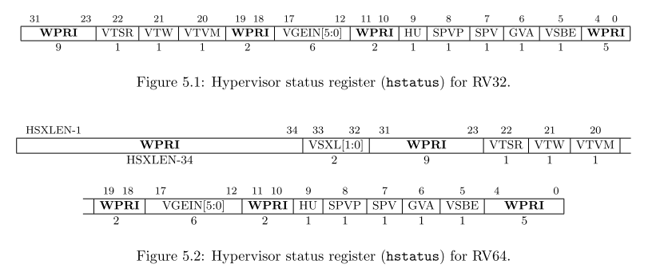
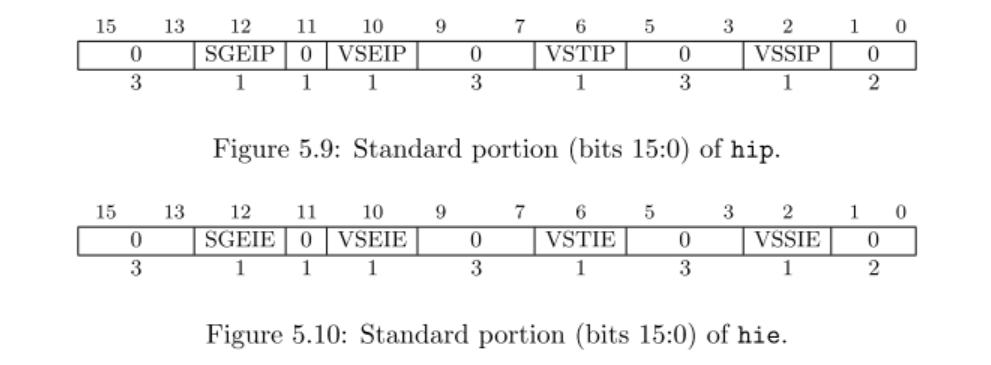
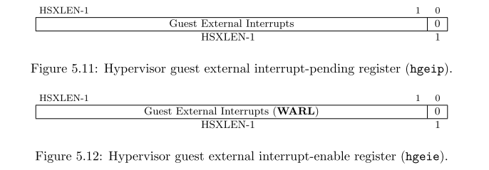

警告！このドラフト仕様は、RISC-V Foundatitonに承認される前に変更される可能性がある。

本節では、スーパーバイザーレベルのアーキテクチャを仮想化して効率的にType-1とType-2のゲストオペレーティングシステムのホスティングを支援するためのハイパーバイザー機能について説明する。

ハイパーバイザー拡張により、スーパーバイザーモードは「ハイパーバイザー拡張スーパーバイザーモード(HSモードもしくは省略してハイパーバイザーモード) 」に変更され、ハイパーバイザーもしくはホスティングに対応したオペレーティングシステムが動作する。ハイパーバイザー拡張はアドレス変換にステージを1つ追加し、「ゲスト物理アドレス」から「スーパバイザ―物理アドレス」への変換を行い、メモリとメモリマップドI/Oのサブシステムをゲストオペレーティングシステムに仮想化する。HSモードはSモードと同様に動作するが、アドレス変換の新たなステージと、仮想Sモード(VSモード)内でゲストOSのホスティングをサポートするための新たな命令とCSRが追加される。通常のSモードのオペレーティングシステムは変更することなくHSモードとVSモードのゲストとして実行する。

HSモードでは、OSまたはハイパーバイザーは、OSが通常Sモードから行うのと同じSBIを介してマシンと対話する。HSモードのハイパーバイザーは、そのVSモードのゲストにSBIを実装することが期待されている。

ハイパーバイザー拡張機能は、文字Hに対応するmisa CSRのビット7を設定することで有効になる。misa[7]がクリアされている場合、Hartはこの拡張機能が実装されていないかのように動作し、ハイパーバイザーCSRまたは命令を使用しようとすると、 不正な命令例外。 ハイパーバイザー拡張を含む実装は、その拡張を無効化するために`misa[7]`をハードワイヤにしないことが推奨されている。

> ベースライン特権アーキテクチャは、少数の特権命令を簡単に検出してトラップできるため、ゲストOSがユーザーレベルで実行される従来の仮想化技術の使用を簡素化するように設計されている。 ハイパーバイザー拡張機能は、これらのトラップの頻度を減らすことにより、仮想化パフォーマンスを向上させる。

> ハイパーバイザー拡張機能は、ハイパーバイザーをSモードで実行し、MモードにトラップしてハイパーバイザーCSRアクセスをシャドウイングし、シャドウページテーブルを維持することにより、拡張機能を実装しないプラットフォームで効率的にエミュレートできるように設計されている。 Type-2ハイパーバイザーのCSRアクセスの大部分は有効なSモードアクセスであるため、トラップする必要はない。 ハイパーバイザーは、同様にネストされた仮想化をサポートする。

## 5.1 Privilege Modes

Vで示される現在の仮想化モードは、Hartが現在ゲストで実行されているかどうかを示す。V=1の場合、Hartは仮想Sモード(VSモード)、またはVSモードで実行されているゲストOSの仮想Uモード(VUモード)のいずれかにある。 V=0の場合、HartはMモード、HSモード、またはHSモードで実行されているOSの下のUモードのいずれかになる。 仮想化モードは、2レベルのアドレス変換がアクティブ(V=1)か非アクティブ(V=0)かを示す。 表5.1は、ハイパーバイザー拡張機能を備えたRISC-V Hartの可能な動作モードを示している。

| 仮想化モード(V) | 特権エンコーディング | 略称     | 名前                                  | 2段階変換 |
| --------------- | -------------------- | -------- | ------------------------------------- | --------- |
| 0               | 0                    | Uモード  | ユーザモード                          | Off       |
| 0               | 1                    | HSモード | ハイパーバイザ拡張 スーパバイザモード | Off       |
| 0               | 3                    | Mモード  | マシンモード                          | Off       |
| 1               | 0                    | VUモード | 仮想ユーザモード                      | On        |
| 1               | 1                    | VSモード | 仮想スーパバイザモード                | On        |

## 5.2 Hypervisor and Virtual Supervisor CSRs

HSモードで実行されているOSまたはハイパーバイザーは、スーパーバイザCSRを使用して、例外、割り込み、およびアドレス変換サブシステムと対話する。 HSモードには追加のCSRが提供されるが、VSモードには提供されない。HSモードのCSRは2ステージのアドレス変換を管理し、VSモードゲストの動作を制御するために以下のレジスタが追加される：`hstatus`、`hedeleg`、`hideleg`、`hvip`、`hip`、`hie`、`hgeip`、`hgeie` 、`hcounteren`、`htimedelta`、`htimedeltah`、`htval`、`htinst`、および`hgatp`。

さらに、いくつかの仮想スーパーバイザCSR(VS CSR)は、通常のスーパーバイザCSRのレプリカである。たとえば、`vsstatus`は、通常の`sstatus` CSRを複製するVS CSRである。

V = 1の場合、VS CSRは対応するスーパーバイザCSRの代わりになり、特に指定のない限り、通常のスーパーバイザCSRのすべての機能を引き継ぐ。通常、スーパーバイザCSRを読み取るか変更する命令は、対応するVS CSRにアクセスする。 V = 1の場合、VS CSRを独自の個別のCSRアドレスで直接読み書きしようとすると、仮想命令例外が発生する。 (Uモードからの試行は、通常どおり、不正な命令例外を引き起こす。)VS CSRは、MモードまたはHSモードからのみ、それ自体としてアクセスする。

V = 1の間、VS CSRに置き換えられた通常のHSレベルのスーパーバイザCSRはその値を保持するが、特に文書化されていない限り、マシンの動作には影響しません。逆に、V = 0の場合、VS CSRは通常、CSR命令によって読み取りと書き込みができること以外は、マシンの動作に影響を与えません。

いくつかの標準スーパーバイザCSR(`scounteren`、およびN拡張が実装されている場合、`sedeleg`および`sideleg`)には、一致するVS CSRがない。これらのスーパーバイザCSRは、VSモードとVUモードがHSモードとUモードに置き換わる場合を除いて、V = 1の場合でも通常の機能とアクセス可能性を維持する。ハイパーバイザーソフトウェアは、必要に応じてこれらのレジスターの内容を手動でスワップする必要がある。

> 一致するVS CSRは、複製する必要があるスーパーバイザCSRにのみ存在する。これらは主に、トラップによって自動的に書き込まれるもの、またはトラップエントリの直後やSRETの直前に命令の実行に影響を与えるもので、ソフトウェアのみでCSRをスワップできない場合に使用される。 まさに適切な瞬間。 現在、ほとんどのスーパーバイザCSRはこのカテゴリに分類されるが、将来のCSRは分類されない可能性がある。

この章では、`HSXLEN`という用語を使用してHSモードで実行するときの有効なXLENを指し、`VSXLEN`を使用してVSモードで実行するときの有効なXLENを指する。

### 5.2.1 ハイパーバイザーステータスレジスタ (hstatus)

`hstatus`レジスタは、HSXLEN = 32の場合はFigure 5.1に、HSXLEN = 64の場合はFigure 5.2に示すようにフォーマットされたHSXLENビットの読み取り/書き込みレジスタである。 `hstatus`レジスタは、VSモードゲストの例外動作を追跡および制御するための`mstatus`レジスタに類似した機能を提供する。

VSXLフィールドは、VSモードの有効なXLEN（VSXLENとして知られている）を制御する。これは、HSモードのXLEN（HSXLEN）とは異なる場合がある。 HSXLEN = 32の場合、VSXLフィールドは存在せず、VSXLEN = 32である。 HSXLEN = 64の場合、VSXLは、16ページのFigure-3.1に示すmisaのMXLフィールドと同じようにエンコードされるWARLフィールドです。特に、実装により、VSXLを読み取り専用フィールドにすることができ、これによりVSXLEN = HSXLENを保証する。

もしHSXLENが32からより大きいビット幅に変更された場合かつVSXLが複数の値を持つことができる場合、新しいHSXLENよりも大きくないサポートされている最大の値を設定することができる。

`hstatus`のフィールドVTSR, VTW, VTVMは`mstatus`のフィールド`TSR, TW, TVM`と同じ役割を持っており、VSモードにのみ影響を与える。これは不正命令例外の代わりに仮想命令例外を発生させる。VTSR=1の場合、VSモードでSRETめいれいを実行しようとすると仮想命令例外を発生させる。VTW=1(かつmstatus.TV=0であると仮定する)の場合、VSモードでWFI命令を実行しWFIが実装によって定められるタイムリミットに到達すると仮想命令例外が発生する。VTVM=1の場合、VSモード中にSFENCE.VMAを実行するか`satp`CSRにアクセスすると仮想命令例外が発生する。

VGEIN(Virtual Guest External Interrupt Number)フィールドはVSレベルの外部割込みに対するゲストの外部割込みソースを選択する。VGEINはWLRLフィールドであり、0からゲストの外部割込み番号(GEILEN)までの間の値を設定しなければならない。VGEIN=0の場合、VSレベルの外部割込みに対してゲストの外部割込みソースは選択されていない。GEILENが0であるならば、VGEINはハードワイヤでゼロに設定されている。ゲストの割り込みについては5.2.4層で説明しており、VGEINについては5.2.3章でより詳細に説明している。

HUフィールド(Hypervisor User mode)では仮想マシンのロードストア命令を制御している。HLV, HLVX, HSVもUモードで使用することができる。HU=1の時、これらの命令はUモード上でHSモードと同様に実行される。HU=0のとき、Uモード中でのすべてのハイパーバイザー命令は不正命令例外を発生させる。

> HUビットを使用することで、ハイパーバイザーの一部をUモードで実行して、仮想マシンのメモリアクセスを維持しながらソフトウェアのバグに対する保護を強化することができる。

SPVビット(Supervisor Previous Virtualization mode)はトラップがHSモードによって捕らえられた場合に、実装によって書き込まれるビットである。`sstatus`のSPPビットと同様に、トラップ発生時の特権モードが設定され、`hstatus`のSPVビットはトラップが発生すると仮想モードVの値が設定される。V=0の時にSRET命令が実行されると、SPVにはVが設定される。

V=1の時にトラップによりHSモードによって捕らえられた場合、SPVP(Supervisor Previous Virtual Privilege)ビットに、トラップ発生時の特権モードの情報が設定される。これは`sstatus.SPP`と同様である。しかしトラップ前にV=0だった場合、SPVPはトラップのエントリで値は変更されていない。SPVPは仮想マシンロードストア命令であるHLV, HLVX, HSVによって発生する明確なメモリアクセスの特権の影響を制御する。

> SPVPを使わない場合、もしHLV, HLVX, HSV命令がメモリアクセスの特権モード影響を確認するために代わりに`sstatus.SPP`を使用することになる。この場合、HU=1であったとしてもUモードでもVSレベル仮想マシンメモリにアクセスできなくなる。なぜなら、Uモードに入るためのSRET命令は常にSPP=0に設定するからである。SPPとは異なり、SPVPはHSモードとUモードの行き来については関与しない。

GVAフィールド(Guest Virtual Address)はHSモードでトラップが捕らえられた場合に実装によって書き込まれる。ゲストの仮想アドレスを`stval`に書き込むような任意のトラップ(アクセスフォルト、ページフォルト、ゲストページフォルト)の場合、GVAは1が設定される。HSモードにトラップされるそれ以外のトラップについては、GVAは0に設定される。

> メモリフォルトでは、GVAはHLV,HLVX, HSV命令によるフォルト発生時を除いてSPVと冗長である。このような場合には、SPV=0に設定されるがGVA=1となる。

VSBEビットはWARL属性のフィールドで、VSモードのメモリアクセスに対するエンディアンを制御する。VSBE=0の場合、VSモードで実行されるロードストアメモリあくっせうはリトルエンディアンであり、VSBE=1の場合はビッグエンディアンである。VSBEはVSレベルでの、ページテーブルなどのメモリ管理データ構造へのメモリアクセスのエンディアンも制御する。実装によっては、VSBEをリードオンリーに設定しHSモードと同じエンディアンに設定することもある。

### 5.2.2 ハイパーバイザートラップ譲与レジスタ (hedeleg and hideleg)

`hedeleg`および`hideleg`はHSXLENビットの読み書き可能なレジスタで、Figure-5.3およびFigure-5.4のようなフォーマットである。デフォルトでは、任意の特権レベルのトラップはMモードによって制御されるが、通常Mモードは`medeleg`と`mideleg`CSRを使用していくつかのトラップをHSモードに移譲する。`hedeleg`と`hideleg`CSRはこれらのトラップをさらにVSモードのゲストに対して移譲することができる; これらのレジスタのレイアウトは`medeleg`と`mideleg`レジスタと同じである。

| ビット | 属性             | 該当する例外                              |
| ------ | ---------------- | ----------------------------------------- |
| 0      | 本文を参照のこと | 命令アドレスミスアライン                  |
| 1      | Writable         | 命令アクセスフォルト                      |
| 2      | Writable         | 不正命令                                  |
| 3      | Writable         | ブレークポイント                          |
| 4      | Writable         | ロードアドレスミスアライン                |
| 5      | Writable         | ロードアクセスフォルト                    |
| 6      | Writable         | ストア/AMOアドレスミスアライン            |
| 7      | Writable         | ストア/AMOアクセスフォルト                |
| 8      | Writable         | UモードもしくはVUモードのEnvironment Call |
| 9      | Read-only 0      | HSモードのEnvironment Call                |
| 11     | Read-only 0      | MモードのEnvironment Call                 |
| 12     | Writable         | 命令ページフォルト                        |
| 13     | Writable         | ロードページフォルト                      |
| 15     | Writable         | ストア/AMOページフォルト                  |
| 20     | Read-only 0      | 命令ゲストページフォルト                  |
| 21     | Read-only 0      | ロードゲストページフォルト                |
| 22     | Read-only 0      | 仮想命令                                  |
| 23     | Read-only 0      | ストア/AMOゲストページフォルト            |

(`medeleg`を使用して)HSモードに移譲される同期トラップは、該当する`hedeleg`ビットを設定することによって、トラップが発生する前にV=1の場合さらにVSモードに移譲される。`hedeleg`の各ビットはWritableかハードワイヤゼロに固定されている。表5.2のように、`hedeleg`の多くのビットはWritableであるか、ゼロであることが要求されている。ビット0、つまり命令アドレスミスアライン例外についてはIALIGN=32である場合にWritableとなる。

> `hedeleg`の特定のビットが設定可能であることにより、実装のバリエーションを処理するためのハイパーバイザーの負担が軽減される。

(`mideleg`を使用して)HSモードに移譲される割込みは、該当する`hideleg`ビットを設定することによってVSモードに移譲される。`hideleg`の15:0ビットの内、10、6、２(VSレベルの標準割り込みに相当する)のみ書き込み可能であり、それ以外のビットはゼロに固定されている。

仮想スーパーバイザー外部割込み(要因10)はVSモードに移譲され、自動的にマシンモードからVSモードのスーパバイザ外部割込み(要因10)に移譲される、割り込み発生時に`vscause`に要因コードも書き込まれる)。同様に、仮想スーパーバイザタイマ割り込み(要因6)はVSモードのスーパバイザ―タイマ割り込み変換され、仮想スーパバイザソフトウェア割込み(要因2)はVSモードのためのスーパーバイザソフトウェア割込み(要因1)に変換される。同様の変換はプラットフォームもしくはカスタム割り込み要因(要因16以上のもの)に応じて設定される。

### 5.2.3 ハイパーバイザー割り込みレジスタ (hvip, hip, and hie)

`hvip`レジスタはHSXLENビットの読み書き可能なレジスタで、ハイパーバイザーがVSモードの仮想割込みのために書き込む子おtができる。`hideleg`内の書き込み可能なビットは、`hvip`でも書き込み可能である。それ以外の`hvip`内のビットはゼロに固定されている。

`hvip`の標準的なビット(ビット15から0)をFigure 5.6に示す。`hvip`レジスタ内のVSEIPを1に設定することで、VSレベルの割り込みがアサートされる; VSTIPを設定することによりVSレベルのタイマ割り込みがアサートされる; VSSIPを設定することによりVSレベルのソフトウェア割込みがアサートされる。

`hip`レジスタと`hie`レジスタはHSXLENビットの読み書き可能なレジスタでHSレベルで`sip`と`sie`レジスタの代替レジスタである。`hip`レジスタはVSレベルとハイパーバイザー固有の割り込みのペンディング状態を示す。`hie`レジスタは`hip`と同様の割り込みに対する許可状態を示す。`sip`と`sie`レジスタと同様に`hip`と`hie`レジスタの`i`ビット目が設定され、かつスーパーバイザーレベルの割り込みがグローバルに有効化されている場合にHSモードに割り込みが挿入される。

`sie`レジスタ内の書き込み可能なビットでは、同じ場所の`hip`と`hie`レジスタはゼロに固定されている。従って`sie`と`hie`のゼロでないビットの場所は常に排他的であり、これは`sip`と`hip`についても同様である。

> `hip`と`hie`の有効なビットをHSレベルの`sip`と`sie`に配置することはできない。何故ならば、ハードウェアに実装されていないプラットフォームでハイパーバイザー拡張機能をソフトウェアがエミュレートできなくなるためである。

もし`sie`のビット`i`がゼロに固定されているならば、`hip`の同じ場所のビットは書き込み可能か、読み込み専用である。`hip`のビット`i`が書き込み可能ならば、ペンディングしている割り込み`i`は0を書き込むことでクリアすることができる。もし割り込み`i`が`hip`の`i`ビットによりペンディング状態になり、`hip`の`i`ビットが読み込み専用である場合、`hvip`の`i`ビットをクリアすることにより割り込みをクリアするか、実装はペンディング中の割り込みをクリアするための任意の手法を提供しなければならない。

`hip`中でペンディングになることができる割り込みは、`hie`中の同じ割込みに相当するビットが書き込み可能である。`hie`の書き込み不可能なビットは0に固定されている。

`hip`および`hie`の標準的なビット位置(ビット15からビット0まで)はFigure 5.9およびFigure 5.10のように構成されている。

`hip.SGEIP`および`hie.SGEIE`はゲストの外部割込みをスーパバイザレベル(HSレベル)で受け付けるための割り込みペンディングビットと割り込み許可ビットである。SGEIPは`hip`内で読み込み専用で、CSRの`hgeip`および`hgeie`がゼロでない場合にのみ1が設定される(5.2.4節を参照のこと)。

`hip.VSEIP`および`hie.VSEIE`はVSレベルの外部割込みを受け付けるための割り込みペンディングビットおよび割り込み許可ビットである。`VSEIP`は読み込み専用ビットで、以下の割込みソースの論理和が設定される。

- `hvip`の`VSEIP`ビット
- `hstatus.VGEIN`によって選択された`hgeip`のビット
- VSレベルに接続されるその他の任意のプラットフォーム固有外部割込みビット

`hip.VSTIP`および`hie.VSTIE`はVSレベルタイマー割り込みの割り込みペンディングビットおよび割り込み許可ビットである。`VSETIP`は`hip`の読み込み専用ビットで、`hvip.STIP`およびVSレベルに接続される他のプラットフォーム固有のタイマー割り込みシグナルの論理和が接続される。

`hip.VSSIP`および`hie.VSSIE`はVSレベルソフトウェア割込みの割り込みペンディングビットおよび割り込み許可ビットである。`hip`の`VSSIP`ビットは`hvip`の同じビットのエイリアスである(書き込み可能)。

HSモードに複数の割り込みが同時に到達した場合、以下の降順の優先度により割り込み処理が行われる：`SEI, SSI, STI, SGEI, VSEI, VSSI, VSTI`。

### ハイパーバイザーゲスト外部割込みレジスタ(hgeip, hgeie)

`hgeip`レジスタはHSXLENビットの読み込み専用レジスタで、Figure-5.11のようなレジスタレイアウトである。このレジスタはゲストの外部割込みのペンディング状態を示す。`hgeie`レジスタはHSXLENビットの読み書き可能なレジスタで、Figure-5.12のようなレジスタレイアウトである。このレジスタ外部割込みの許可状態を示す。ゲストの外部割込み番号`i`は、`hgeip`と`hgeie`の`i`ビット目に格納されている。

ゲストの外部割込みは、VSレベルの各仮想マシンから通知される割込みである。RISC-Vプラットフォームが、物理デバイスを直接ゲストOSの制御化に置き、ハイパーバイザーからの介入を最小化する(仮想マシンと物理デバイス間のパススルー、もしくはダイレクトアサインメントと呼ばれる)ような環境下では、デバイスからの割り込みは特定の仮想マシンへ直接通知される。`hgeip`の各ビットは、割り込みコントローラから通知される1つの仮想HARTに対するすべてのペンディング中の割り込みをまとめている。複数デバイスからペンディング中の割り込みを識別するためには、ソフトウェアが割り込みコントローラを確認する必要がある。

> ゲストの外部割込みをサポートするためには、割り込みコントローラにより仮想マシンに直接挿入する割り込みをサポートする必要がある。

ゲストの外部割込みのために`hgeip`および`hgeie`に実装されているビットの数は「指定されておらず」ゼロの可能性がある。この数はGEILENとして表現される。ビット0を除いて、最下位ビットが最初に実装される。従ってGEILENがゼロでない場合、`GEILEN:1`が`hgeie`により書き込み可能であり、`hgiep`および`hgiee`においてそれ以外のビット位置はゼロに固定されている。

> 1つの物理HARTで受信および処理されるゲスト外部割り込みのセットは、他のHARTで受信されるものとは異なる場合がある。1つの物理HARTのゲスト外部割り込み番号`i`は、通常、他のHARTのゲスト外部割り込み`i`と同じではないと予想される。 1つの物理HARTについて、ゲストの外部割り込みを直接受信できる仮想HARTの最大数は、GEILENによって制限される。 物理的なHARTごとに、この数の最大値は、RV32の場合は31、RV64の場合は63である。
>
> ハイパーバイザーは、GEILENに制限されることなく、任意の数の仮想HARTのデバイスをいつでも自由にエミュレートできる。 割り込みの直接パススルー(直接割り当て)のみがGEILEN制限の影響を受ける。制限は、受信した個別の割り込みの数ではなく、そのような割り込みを受信する仮想HARTの数にある。 1つの仮想HARTが受け取る可能性のある個別の割り込みの数は、割り込みコントローラーによって決定される。

レジスタ`hgie`はスパーバイザレベル(HSレベル)のゲスト外部割込みを発生させるゲスト外部割込みのサブセットを選択する。`hgeie`の割り込み許可ビットは`hstatus.VGEIN`によって`hgeip`により選択されるVSレベルの外部割込み信号の影響を与えない。

