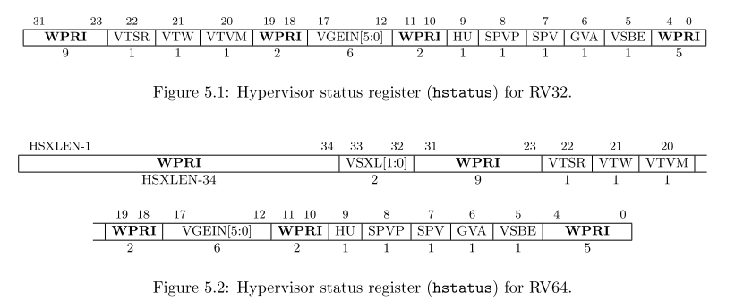
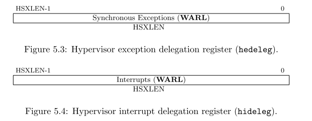

警告！このドラフト仕様は、RISC-V
Foundatitonに承認される前に変更される可能性がある。

本節では、スーパーバイザーレベルのアーキテクチャを仮想化して効率的にType-1とType-2のゲストオペレーティングシステムのホスティングを支援するためのハイパーバイザー機能について説明する。

ハイパーバイザー拡張により、スーパーバイザーモードは「ハイパーバイザー拡張スーパーバイザーモード(HSモードもしくは省略してハイパーバイザーモード)
」に変更され、ハイパーバイザーもしくはホスティングに対応したオペレーティングシステムが動作する。ハイパーバイザー拡張はアドレス変換にステージを1つ追加し、「ゲスト物理アドレス」から「スーパバイザ―物理アドレス」への変換を行い、メモリとメモリマップドI/Oのサブシステムをゲストオペレーティングシステムに仮想化する。HSモードはSモードと同様に動作するが、アドレス変換の新たなステージと、仮想Sモード(VSモード)内でゲストOSのホスティングをサポートするための新たな命令とCSRが追加される。通常のSモードのオペレーティングシステムは変更することなくHSモードとVSモードのゲストとして実行する。

HSモードでは、OSまたはハイパーバイザーは、OSが通常Sモードから行うのと同じSBIを介してマシンと対話する。HSモードのハイパーバイザーは、そのVSモードのゲストにSBIを実装することが期待されている。

ハイパーバイザー拡張機能は、文字Hに対応するmisa
CSRのビット7を設定することで有効になる。misa[7]がクリアされている場合、Hartはこの拡張機能が実装されていないかのように動作し、ハイパーバイザーCSRまたは命令を使用しようとすると、
不正な命令例外。
ハイパーバイザー拡張を含む実装は、その拡張を無効化するために\ ``misa[7]``\ をハードワイヤにしないことが推奨されている。

   ベースライン特権アーキテクチャは、少数の特権命令を簡単に検出してトラップできるため、ゲストOSがユーザーレベルで実行される従来の仮想化技術の使用を簡素化するように設計されている。
   ハイパーバイザー拡張機能は、これらのトラップの頻度を減らすことにより、仮想化パフォーマンスを向上させる。

..

   ハイパーバイザー拡張機能は、ハイパーバイザーをSモードで実行し、MモードにトラップしてハイパーバイザーCSRアクセスをシャドウイングし、シャドウページテーブルを維持することにより、拡張機能を実装しないプラットフォームで効率的にエミュレートできるように設計されている。
   Type-2ハイパーバイザーのCSRアクセスの大部分は有効なSモードアクセスであるため、トラップする必要はない。
   ハイパーバイザーは、同様にネストされた仮想化をサポートする。

5.1 Privilege Modes
-------------------

Vで示される現在の仮想化モードは、Hartが現在ゲストで実行されているかどうかを示す。V=1の場合、Hartは仮想Sモード(VSモード)、またはVSモードで実行されているゲストOSの仮想Uモード(VUモード)のいずれかにある。
V=0の場合、HartはMモード、HSモード、またはHSモードで実行されているOSの下のUモードのいずれかになる。
仮想化モードは、2レベルのアドレス変換がアクティブ(V=1)か非アクティブ(V=0)かを示す。
表5.1は、ハイパーバイザー拡張機能を備えたRISC-V
Hartの可能な動作モードを示している。

+--------------+--------------+----------+--------------+-----------+
| 仮想         | 特権エン     | 略称     | 名前         | 2段階変換 |
| 化モード(V)  | コーディング |          |              |           |
+==============+==============+==========+==============+===========+
| 0            | 0            | Uモード  | ユーザモード | Off       |
+--------------+--------------+----------+--------------+-----------+
| 0            | 1            | HSモード | ハイパ       | Off       |
|              |              |          | ーバイザ拡張 |           |
|              |              |          | スーパ       |           |
|              |              |          | バイザモード |           |
+--------------+--------------+----------+--------------+-----------+
| 0            | 3            | Mモード  | マシンモード | Off       |
+--------------+--------------+----------+--------------+-----------+
| 1            | 0            | VUモード | 仮想         | On        |
|              |              |          | ユーザモード |           |
+--------------+--------------+----------+--------------+-----------+
| 1            | 1            | VSモード | 仮想スーパ   | On        |
|              |              |          | バイザモード |           |
+--------------+--------------+----------+--------------+-----------+

5.2 Hypervisor and Virtual Supervisor CSRs
------------------------------------------

HSモードで実行されているOSまたはハイパーバイザーは、スーパーバイザCSRを使用して、例外、割り込み、およびアドレス変換サブシステムと対話する。
HSモードには追加のCSRが提供されるが、VSモードには提供されない。HSモードのCSRは2ステージのアドレス変換を管理し、VSモードゲストの動作を制御するために以下のレジスタが追加される：\ ``hstatus``\ 、\ ``hedeleg``\ 、\ ``hideleg``\ 、\ ``hvip``\ 、\ ``hip``\ 、\ ``hie``\ 、\ ``hgeip``\ 、\ ``hgeie``
、\ ``hcounteren``\ 、\ ``htimedelta``\ 、\ ``htimedeltah``\ 、\ ``htval``\ 、\ ``htinst``\ 、および\ ``hgatp``\ 。

さらに、いくつかの仮想スーパーバイザCSR(VS
CSR)は、通常のスーパーバイザCSRのレプリカである。たとえば、\ ``vsstatus``\ は、通常の\ ``sstatus``
CSRを複製するVS CSRである。

V = 1の場合、VS
CSRは対応するスーパーバイザCSRの代わりになり、特に指定のない限り、通常のスーパーバイザCSRのすべての機能を引き継ぐ。通常、スーパーバイザCSRを読み取るか変更する命令は、対応するVS
CSRにアクセスする。 V = 1の場合、VS
CSRを独自の個別のCSRアドレスで直接読み書きしようとすると、仮想命令例外が発生する。
(Uモードからの試行は、通常どおり、不正な命令例外を引き起こす。)VS
CSRは、MモードまたはHSモードからのみ、それ自体としてアクセスする。

V = 1の間、VS
CSRに置き換えられた通常のHSレベルのスーパーバイザCSRはその値を保持するが、特に文書化されていない限り、マシンの動作には影響しません。逆に、V
= 0の場合、VS
CSRは通常、CSR命令によって読み取りと書き込みができること以外は、マシンの動作に影響を与えません。

いくつかの標準スーパーバイザCSR(``scounteren``\ 、およびN拡張が実装されている場合、\ ``sedeleg``\ および\ ``sideleg``)には、一致するVS
CSRがない。これらのスーパーバイザCSRは、VSモードとVUモードがHSモードとUモードに置き換わる場合を除いて、V
=
1の場合でも通常の機能とアクセス可能性を維持する。ハイパーバイザーソフトウェアは、必要に応じてこれらのレジスターの内容を手動でスワップする必要がある。

   一致するVS
   CSRは、複製する必要があるスーパーバイザCSRにのみ存在する。これらは主に、トラップによって自動的に書き込まれるもの、またはトラップエントリの直後やSRETの直前に命令の実行に影響を与えるもので、ソフトウェアのみでCSRをスワップできない場合に使用される。
   まさに適切な瞬間。
   現在、ほとんどのスーパーバイザCSRはこのカテゴリに分類されるが、将来のCSRは分類されない可能性がある。

この章では、\ ``HSXLEN``\ という用語を使用してHSモードで実行するときの有効なXLENを指し、\ ``VSXLEN``\ を使用してVSモードで実行するときの有効なXLENを指する。

5.2.1 Hypervisor Status Register (hstatus)
~~~~~~~~~~~~~~~~~~~~~~~~~~~~~~~~~~~~~~~~~~

``hstatus``\ レジスタは、HSXLEN = 32の場合はFigure 5.1に、HSXLEN =
64の場合はFigure
5.2に示すようにフォーマットされたHSXLENビットの読み取り/書き込みレジスタである。
``hstatus``\ レジスタは、VSモードゲストの例外動作を追跡および制御するための\ ``mstatus``\ レジスタに類似した機能を提供する。

   image-20200926104528815

VSXLフィールドは、VSモードの有効なXLEN（VSXLENとして知られている）を制御する。これは、HSモードのXLEN（HSXLEN）とは異なる場合がある。
HSXLEN = 32の場合、VSXLフィールドは存在せず、VSXLEN = 32である。 HSXLEN
=
64の場合、VSXLは、16ページのFigure-3.1に示すmisaのMXLフィールドと同じようにエンコードされるWARLフィールドです。特に、実装により、VSXLを読み取り専用フィールドにすることができ、これによりVSXLEN
= HSXLENを保証する。

もしHSXLENが32からより大きいビット幅に変更された場合かつVSXLが複数の値を持つことができる場合、新しいHSXLENよりも大きくないサポートされている最大の値を設定することができる。

``hstatus``\ のフィールドVTSR, VTW,
VTVMは\ ``mstatus``\ のフィールド\ ``TSR, TW, TVM``\ と同じ役割を持っており、VSモードにのみ影響を与える。これは不正命令例外の代わりに仮想命令例外を発生させる。VTSR=1の場合、VSモードでSRETめいれいを実行しようとすると仮想命令例外を発生させる。VTW=1(かつmstatus.TV=0であると仮定する)の場合、VSモードでWFI命令を実行しWFIが実装によって定められるタイムリミットに到達すると仮想命令例外が発生する。VTVM=1の場合、VSモード中にSFENCE.VMAを実行するか\ ``satp``\ CSRにアクセスすると仮想命令例外が発生する。

VGEIN(Virtual Guest External Interrupt
Number)フィールドはVSレベルの外部割込みに対するゲストの外部割込みソースを選択する。VGEINはWLRLフィールドであり、0からゲストの外部割込み番号(GEILEN)までの間の値を設定しなければならない。VGEIN=0の場合、VSレベルの外部割込みに対してゲストの外部割込みソースは選択されていない。GEILENが0であるならば、VGEINはハードワイヤでゼロに設定されている。ゲストの割り込みについては5.2.4層で説明しており、VGEINについては5.2.3章でより詳細に説明している。

HUフィールド(Hypervisor User
mode)では仮想マシンのロードストア命令を制御している。HLV, HLVX,
HSVもUモードで使用することができる。HU=1の時、これらの命令はUモード上でHSモードと同様に実行される。HU=0のとき、Uモード中でのすべてのハイパーバイザー命令は不正命令例外を発生させる。

   HUビットを使用することで、ハイパーバイザーの一部をUモードで実行して、仮想マシンのメモリアクセスを維持しながらソフトウェアのバグに対する保護を強化することができる。

SPVビット(Supervisor Previous Virtualization
mode)はトラップがHSモードによって捕らえられた場合に、実装によって書き込まれるビットである。\ ``sstatus``\ のSPPビットと同様に、トラップ発生時の特権モードが設定され、\ ``hstatus``\ のSPVビットはトラップが発生すると仮想モードVの値が設定される。V=0の時にSRET命令が実行されると、SPVにはVが設定される。

V=1の時にトラップによりHSモードによって捕らえられた場合、SPVP(Supervisor
Previous Virtual
Privilege)ビットに、トラップ発生時の特権モードの情報が設定される。これは\ ``sstatus.SPP``\ と同様である。しかしトラップ前にV=0だった場合、SPVPはトラップのエントリで値は変更されていない。SPVPは仮想マシンロードストア命令であるHLV,
HLVX, HSVによって発生する明確なメモリアクセスの特権の影響を制御する。

   SPVPを使わない場合、もしHLV, HLVX,
   HSV命令がメモリアクセスの特権モード影響を確認するために代わりに\ ``sstatus.SPP``\ を使用することになる。この場合、HU=1であったとしてもUモードでもVSレベル仮想マシンメモリにアクセスできなくなる。なぜなら、Uモードに入るためのSRET命令は常にSPP=0に設定するからである。SPPとは異なり、SPVPはHSモードとUモードの行き来については関与しない。

GVAフィールド(Guest Virtual
Address)はHSモードでトラップが捕らえられた場合に実装によって書き込まれる。ゲストの仮想アドレスを\ ``stval``\ に書き込むような任意のトラップ(アクセスフォルト、ページフォルト、ゲストページフォルト)の場合、GVAは1が設定される。HSモードにトラップされるそれ以外のトラップについては、GVAは0に設定される。

   メモリフォルトでは、GVAはHLV,HLVX,
   HSV命令によるフォルト発生時を除いてSPVと冗長である。このような場合には、SPV=0に設定されるがGVA=1となる。

VSBEビットはWARL属性のフィールドで、VSモードのメモリアクセスに対するエンディアンを制御する。VSBE=0の場合、VSモードで実行されるロードストアメモリあくっせうはリトルエンディアンであり、VSBE=1の場合はビッグエンディアンである。VSBEはVSレベルでの、ページテーブルなどのメモリ管理データ構造へのメモリアクセスのエンディアンも制御する。実装によっては、VSBEをリードオンリーに設定しHSモードと同じエンディアンに設定することもある。

5.2.2 Hypervisor Trap Delegation Registers (hedeleg and hideleg)
~~~~~~~~~~~~~~~~~~~~~~~~~~~~~~~~~~~~~~~~~~~~~~~~~~~~~~~~~~~~~~~~

``hedeleg``\ および\ ``hideleg``\ はHSXLENビットの読み書き可能なレジスタで、Figure-5.3およびFigure-5.4のようなフォーマットである。デフォルトでは、任意の特権レベルのトラップはMモードによって制御されるが、通常Mモードは\ ``medeleg``\ と\ ``mideleg``\ CSRを使用していくつかのトラップをHSモードに移譲する。\ ``hedeleg``\ と\ ``hideleg``\ CSRはこれらのトラップをさらにVSモードのゲストに対して移譲することができる;
これらのレジスタのレイアウトは\ ``medeleg``\ と\ ``mideleg``\ レジスタと同じである。

   image-20200926112852129

====== ================ =========================================
ビット 属性             該当する例外
====== ================ =========================================
0      本文を参照のこと 命令アドレスミスアライン
1      Writable         命令アクセスフォルト
2      Writable         不正命令
3      Writable         ブレークポイント
4      Writable         ロードアドレスミスアライン
5      Writable         ロードアクセスフォルト
6      Writable         ストア/AMOアドレスミスアライン
7      Writable         ストア/AMOアクセスフォルト
8      Writable         UモードもしくはVUモードのEnvironment Call
9      Read-only 0      HSモードのEnvironment Call
11     Read-only 0      MモードのEnvironment Call
12     Writable         命令ページフォルト
13     Writable         ロードページフォルト
15     Writable         ストア/AMOページフォルト
20     Read-only 0      命令ゲストページフォルト
21     Read-only 0      ロードゲストページフォルト
22     Read-only 0      仮想命令
23     Read-only 0      ストア/AMOゲストページフォルト
====== ================ =========================================

(``medeleg``\ を使用して)HSモードに移譲される同期トラップは、該当する\ ``hedeleg``\ ビットを設定することによって、トラップが発生する前にV=1の場合さらにVSモードに移譲される。\ ``hedeleg``\ の各ビットはWritableかハードワイヤゼロに固定されている。表5.2のように、\ ``hedeleg``\ の多くのビットはWritableであるか、ゼロであることが要求されている。ビット0、つまり命令アドレスミスアライン例外についてはIALIGN=32である場合にWritableとなる。

   ``hedeleg``\ の特定のビットが設定可能であることにより、実装のバリエーションを処理するためのハイパーバイザーの負担が軽減される。

(``mideleg``\ を使用して)HSモードに移譲される割込みは、該当する\ ``hideleg``\ ビットを設定することによってVSモードに移譲される。\ ``hideleg``\ の15:0ビットの内、10、6、２(VSレベルの標準割り込みに相当する)のみ書き込み可能であり、それ以外のビットはゼロに固定されている。

仮想スーパーバイザー外部割込み(要因10)はVSモードに移譲され、自動的にマシンモードからVSモードのスーパバイザ外部割込み(要因10)に移譲される、割り込み発生時に\ ``vscause``\ に要因コードも書き込まれる)。同様に、仮想スーパーバイザタイマ割り込み(要因6)はVSモードのスーパバイザ―タイマ割り込み変換され、仮想スーパバイザソフトウェア割込み(要因2)はVSモードのためのスーパーバイザソフトウェア割込み(要因1)に変換される。同様の変換はプラットフォームもしくはカスタム割り込み要因(要因16以上のもの)に応じて設定される。
